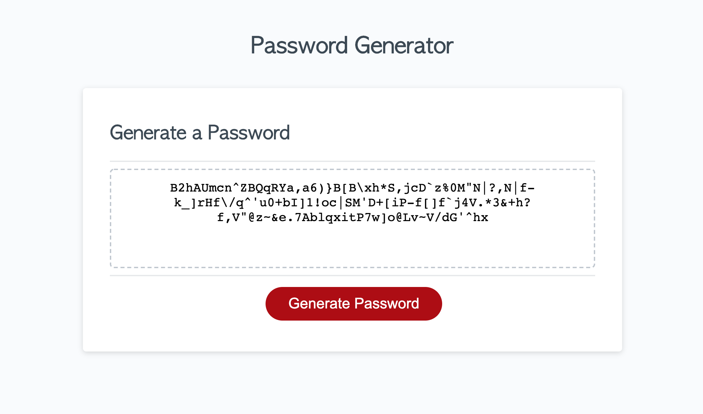
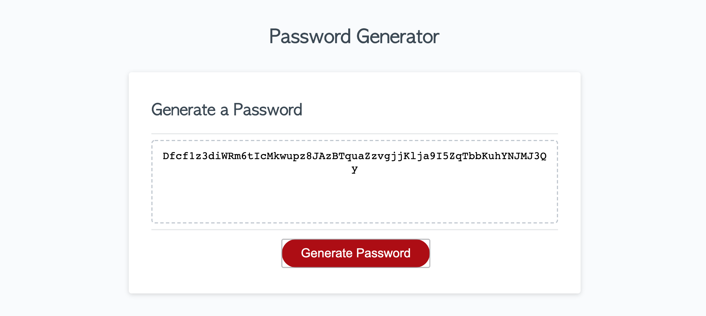

# Password Generator

## What I Did

In this homework, I was to write the JavaScript for a Password Generating website. 
The parameters were:
* ask how many characters the user wants, between 8 and 128, inclusive.
* ask if the user wants upper case letters in their password
* ask if the user wants lower case letters in their password
* ask if the user wants numbers in their password
* ask if the user wants special characters in their password
Once all these values are stored, we are to give the user a randomly generated password using the selected character types. 

## Images

## Technologies Used
* HTML
* JavaScript
* functions and buttons

## Links

to generator:  https://julianriverajr.github.io/Password-Generator/

to github repo: https://github.com/julianriverajr/Password-Generator

### Contact Info
email: julianriverajr@gmail.com
